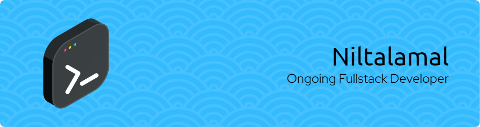

<!--
**tataamal/tataamal** is a ✨ _special_ ✨ repository because its `README.md` (this file) appears on your GitHub profile.

Here are some ideas to get you started:

- 🔭 I’m currently working on ...
- 🌱 I’m currently learning ...
- 👯 I’m looking to collaborate on ...
- 🤔 I’m looking for help with ...
- 💬 Ask me about ...
- 📫 How to reach me: ...
- 😄 Pronouns: ...
- ⚡ Fun fact: ...
-->

### Hi there 👋, I'm Niltal (a.k.a Tata)

I'm a passionate **Full Stack Web Developer** with a focus on building scalable and efficient web applications. I enjoy learning new technologies, contributing to open-source projects, and solving real-world problems through code.

---

### 🚀 About Me
- 🌱 Currently learning **Laravel**, **Git**, and improving my **Full Stack** skills
- 👨‍💻 Previously worked on: `HTML`, `CSS`, `JavaScript`, `PHP`, and `Laravel`
- 💡 Interested in **Web Development**, and **Software Engineering**
- ⚡ Fun fact: I love debugging almost as much as I love coffee ☕
- 📫 Reach me at: [tataamal1128@gmail.com](mailto:tataamal1128@gmail.com?subject=Connect%20With%20Niltal) | [LinkedIn](https://www.linkedin.com/in/yourname/)

---

### 🛠️ Tech Stack
- 💻 **Languages**: , , , 
- ⚙️ **Frameworks/Libraries**: Laravel, Bootstrap, jQuery
- 🛢️ **Databases**: MySQL
- 🔧 **Tools**: Git, VSCode, Figma
- 🌐 **Others**: REST API, JSON, Responsive Design

---

### 📈 GitHub Stats

  

  

---

<!-- ### 📌 Featured Projects
- 🚧 [**Project Name**](https://github.com/yourusername/project) – Short description of what it does
- 🌐 [**Another Project**](https://github.com/yourusername/project2) – Another brief description
- 📱 [**Mobile UI Design**](https://github.com/yourusername/project3) – A mobile-first responsive design project

--- -->

<!-- ### 📝 Latest Blog Posts *(optional if you have a blog)*
<!-- BLOG-POST-LIST:START -->
<!-- - [Title of blog post](#)
- [Another post](#) -->
<!-- BLOG-POST-LIST:END -->

### 🤝 Let's Connect
  

